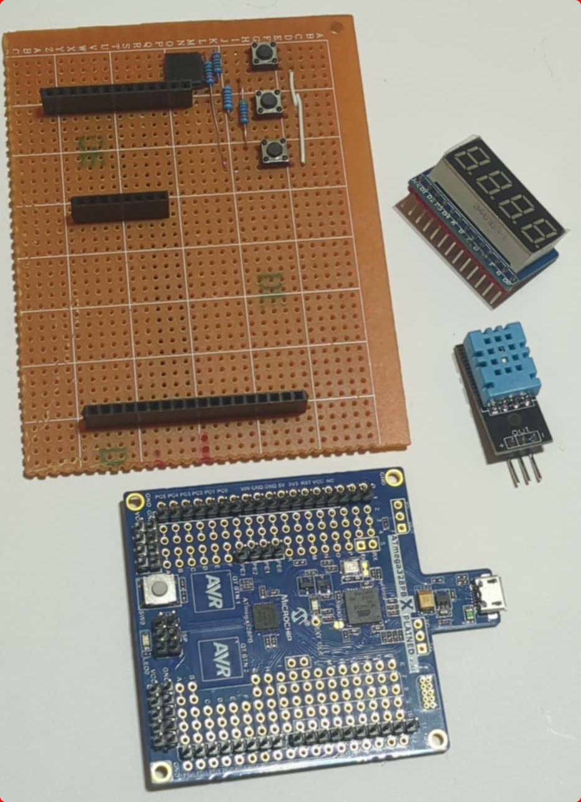
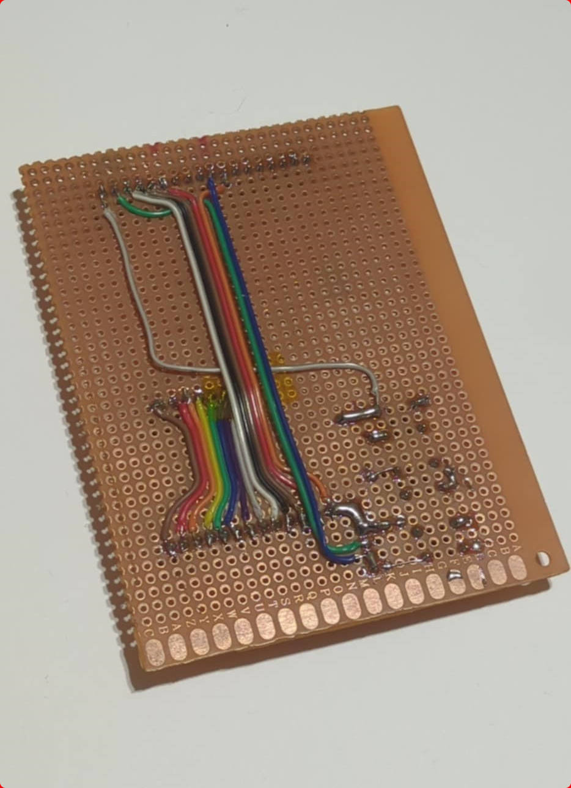
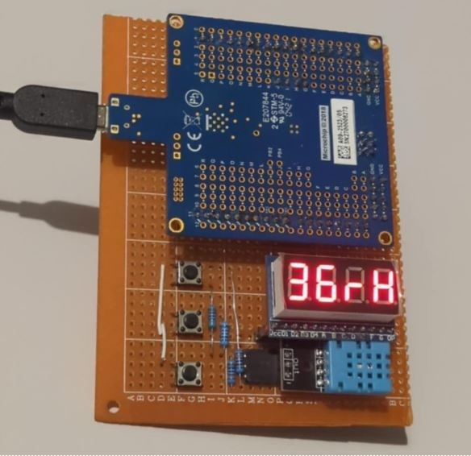
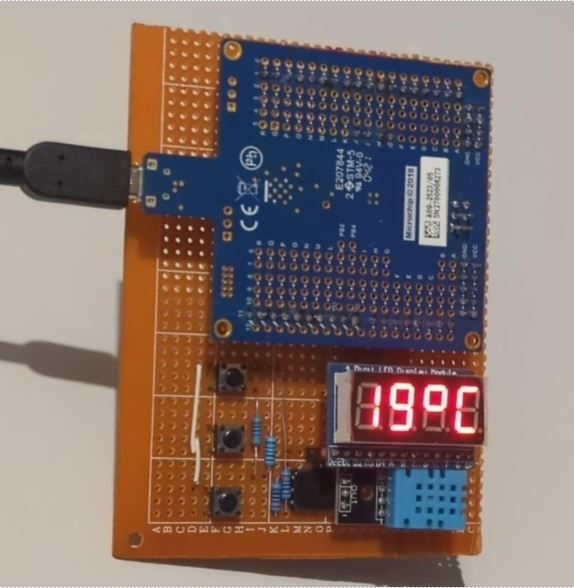

# ThermoHygro328P
<h3>ATmega328P Thermo-Hygrometer with 7-Segment Display</h3>

  
  

An autonomous station for measuring environmental conditions (temperature and relative humidity) based on an 8-bit microcontroller ATmega328P and a cheap DHT-11 sensor. Measurements are presented on a four-digit seven-segment display.

The device has been designed as an educational platform, aimed at exploring the ins and outs of display multiplexing and single-wire communication.

  
  

